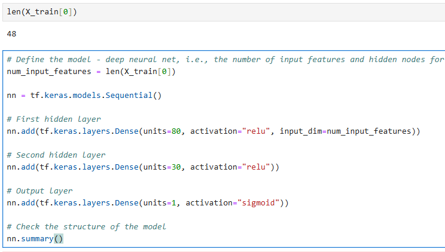

### Neural Network Model Report

# Overview of the analysis
The purpose of this challenge is to create a machine learning model to predict if an organzation's loan application will be successful.

# Results

## Data Preprocessing
- First we drop the ID columns, 'EIN' and 'NAME'. To improve the model, we take a look at application_type and decide which ones have a low frequency
count to put in a bucket named 'other'.

- The target variable is the 'IS_SUCCESSFUL' column, which indicates if the application was approved or not.

- The features include all the other columns except for 'EIN' and 'NAME'
- 'EIN' and 'NAME' were removed from the input data because they are neither targets nor features

## Compiling, Training, and Evaluating the Model

### How many neurons, layers, and activation functions did you select for your neural network model
- Configured to accept 48 input features, determined after one-hot encoding and preprocessing. I used the len function on X_train and put it into a variable to easily determine the correct number in case of making adjustments later.
- Hidden Layer 1: 80 neurons with ReLU activation
- Hidden Layer 2: 30 neurons with ReLU activation
- Output Layer: A single neuron with sigmoid activation for binary classification output

#### ...and why?
- This was chosen for a decent balance of learning the data without fear of over or underfitting.

### Were you able to achieve the target model performance?
- No. The initial model had an Accuracy of nearly 73%, which was the best overall.

### What steps did you take in your attempts to increase model performance?
- In AlphabetSoupCharity_Optimization.ipynb, I made many different choices to find
a better accuracy without success. In fact, several of those led to overfitting. The commented out code in that notebook explains the different approaches taken,
such as smaller or larger binning of low frequency categories, changing the number of epochs, adding additional layers or nodes etc.

# Summary
Overall, the neural network model achieved decent accuracy, with a peak of around 73%. This shows that it captures some patterns in the data but may be limited
by the feature set or the complexity of the neural network architecture. Despite adjustments, the model did not achieve 75% accuracy, with additional
layers or epochs often resulting in overfitting.

I would suggest trying Random Forest because it handles tabular data well and might even outperform a neural network model.
